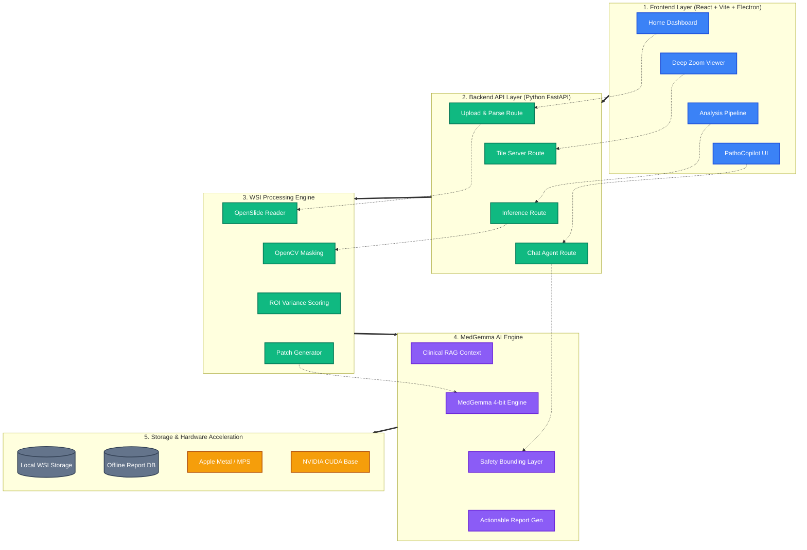

<div align="center">
  

  # PathoAssist: AI-Powered "Digital Fellow" for Pathology
  **Offline-Capable, Privacy-First Medical AI Application**

  [](https://reactjs.org/)
  [](https://fastapi.tiangolo.com/)
  [](https://huggingface.co/google/medgemma-2b-it)
  [](#license)
</div>

---

**PathoAssist** is a medical-grade web application designed specifically for pathology professionals. It serves as an AI-powered "digital fellow" that accelerates the analysis of massive Whole Slide Images (WSIs) and generates explainable, context-aware pathology reports. 

Crucially, the entire system is designed to run entirely **offline on edge devices** (like Apple Silicon MacBooks or standard PCs), ensuring 100% patient data privacy without reliance on cloud API providers.

---

## ✨ Core Features

*   **🔒 Offline & Privacy-First**: Zero external API calls. All WSI processing and AI inference happen locally, guaranteeing that patient health information (PHI) never leaves your physical machine.
*   **🔬 WSI Deep Zoom Viewer**: A high-performance, dynamic "Digital Microscope" capable of smoothly panning and zooming through billion-pixel images (SVS, TIFF, NDPI).
*   **🧠 Context-Aware Clinical RAG**: PathoAssist doesn't just look at images. It injects the patient's Electronic Health Record (EHR) directly into the AI prompt, allowing the MedGemma model to perform holistic, explainable reasoning.
*   **🎯 Smart Tissue Detection**: Implements OpenCV dynamic thresholding to strip away useless glass backgrounds, reducing AI inference processing times by 40-60%.
*   **💬 PathoCopilot Chat**: An interactive interface allowing the pathologist to ask specific questions, debate findings, and refine the AI's suggestions before exporting the final report.
*   **📄 Structured PDF/JSON Exports**: One-click generation of beautifully formatted, human-validated diagnostic reports.
*   **🏥 Simulated EHR Integration**: Mocked connectors demonstrating readiness for Epic, Cerner, HL7, and FHIR integration.

---

## 📸 Technical Showcase

### The 6-Step Clinical Workflow
PathoAssist guides the user through a strict, reproducible workflow to maintain medical standardization: `Upload` → `Viewer` → `ROI Selection` → `AI Analysis` → `Review & Chat` → `Export`.

#### High-Performance WSI Viewer

*Our custom viewer allows pathologists to smoothly zoom into the cellular level at standard clinical magnifications (10x, 20x, 40x).*

#### Context-Aware Reporting & PathoCopilot Review

*AI findings are presented dynamically. The PathoCopilot allows the pathologist to ask natural language questions about specific ROI variances.*

---

## 🏗 System Architecture

PathoAssist implements a rigorous separation between the high-performance React UI and the heavy Python computing core.



---

## 🛠 Tech Stack

### Frontend Application
- **Framework**: `React 18` + TypeScript
- **Styling**: `Tailwind CSS`, `shadcn/ui`, `Radix UI` Primitive Components
- **State/Routing**: `React Router v6`, `TanStack Query`
- **Data Integrity**: `React Hook Form` via `Zod` validation

### Backend API & Processing
- **Server**: `Python FastAPI` (Asynchronous worker handling)
- **Slide Parsing**: `OpenSlide`, `Pillow`
- **Computer Vision**: `OpenCV` (Otsu thresholding and ROI variant detection)
- **AI Inference Engine**: `PyTorch`, `HuggingFace Transformers`, utilizing `bitsandbytes` for low-VRAM 4-bit/8-bit quantization.

---

## 🚀 Getting Started

### 1. Prerequisites
- **Node.js** (v18+)
- **Python** (v3.10+)
- **System Dependencies**: You must install `OpenSlide` onto your base OS (`brew install openslide` or `apt-get install openslide-tools`).

### 2. Quick Setup

```bash
# Clone the repository
git clone <repository-url>
cd pathoassist-ui

# 1. Setup the Python Backend
cd backend
python -m venv venv
source venv/bin/activate
pip install -r requirements.txt
./setup.sh 

# 2. Setup the Frontend
cd ../
npm install
```

### 3. Running the Application

Open two terminal windows:

**Terminal 1 (Backend API):**
```bash
cd backend
source venv/bin/activate
./run.sh
# Server boots at http://127.0.0.1:8000
```

**Terminal 2 (Frontend UI):**
```bash
# In the project root
npm run dev
# Vite runs at http://localhost:8080
```

### Note on Developer Documentation
Internal AI system prompts, integration instructions, and repository structure details have been moved to the `/docs/` folder to maintain a clean root directory.

---

## ⚠️ Medical Device Notice

> **This software is classified as a Decision Support System and is intended for research and educational purposes only. It is explicitly not intended to replace professional medical judgment, diagnosis, or treatment by a licensed healthcare professional.** All generated reports must be manually validated by a board-certified pathologist.

## 📝 License

**Proprietary Software** - All rights reserved. Do not distribute without explicit authorization.
